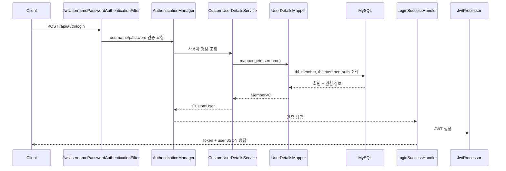

# apiserver

Spring MVC 기반의 Java WAR 프로젝트입니다. MySQL 사용자 정보를 MyBatis로 조회하고, Spring Security와 JWT를 이용해 API 인증/인가를 처리합니다.

## 주요 기능

- Spring MVC 기반 웹 애플리케이션 구성
- HikariCP + MyBatis 기반 MySQL 연동
- Spring Security 기반 인증/인가
- JSON 로그인 API(`/api/auth/login`)와 JWT 발급
- `Authorization: Bearer <token>` 헤더 기반 JWT 인증
- 역할별 API 접근 제어
- JSP ViewResolver, 정적 리소스 매핑, 파일 업로드 설정
- JUnit 5 기반 설정/DB/JWT 테스트

## 기술 스택

| 구분 | 기술 |
| --- | --- |
| Language | Java 17 |
| Build | Gradle, WAR |
| Framework | Spring Framework 5.3.37, Spring Web MVC |
| Security | Spring Security 5.8.13 |
| Database | MySQL 8.x |
| Persistence | MyBatis 3.4.6, mybatis-spring 1.3.2 |
| Connection Pool | HikariCP 2.7.4 |
| JWT | jjwt 0.11.5 |
| View | JSP, JSTL |
| Logging | Log4j2, log4jdbc |
| Test | JUnit 5.9.2 |
| Utility | Lombok, Jackson |

## 프로젝트 구조

```text
apiserver/
├─ build.gradle
├─ settings.gradle
├─ gradlew.bat
├─ src/
│  ├─ main/
│  │  ├─ java/org/scoula/
│  │  │  ├─ config/
│  │  │  │  ├─ RootConfig.java
│  │  │  │  ├─ ServletConfig.java
│  │  │  │  └─ WebConfig.java
│  │  │  ├─ controller/
│  │  │  │  ├─ HomeController.java
│  │  │  │  └─ SecurityController.java
│  │  │  ├─ exception/
│  │  │  │  └─ CommonExceptionAdvice.java
│  │  │  └─ security/
│  │  │     ├─ account/
│  │  │     │  ├─ domain/
│  │  │     │  ├─ dto/
│  │  │     │  ├─ mapper/
│  │  │     │  └─ service/
│  │  │     ├─ config/
│  │  │     ├─ filter/
│  │  │     ├─ handler/
│  │  │     └─ util/
│  │  ├─ resources/
│  │  │  ├─ application.properties
│  │  │  ├─ mybatis-config.xml
│  │  │  └─ org/scoula/security/account/mapper/UserDetailsMapper.xml
│  │  └─ webapp/WEB-INF/views/
│  └─ test/java/org/scoula/
└─ README.md
```

## 최신 작업 반영 내용

최근 작업은 JWT 인증과 Spring Security 설정 쪽에 집중되어 있습니다.

| 파일 | 내용 |
| --- | --- |
| `JwtAuthenticationFilter.java` | `Authorization` 헤더에서 Bearer 토큰을 읽고 SecurityContext에 인증 객체 저장 |
| `SecurityConfig.java` | JWT 필터, 로그인 필터, 예외 처리 핸들러, Stateless 세션 정책, 권한별 API 접근 제어 설정 |
| `SecurityController.java` | `/api/security/all`, `/api/security/member`, `/api/security/admin` API 제공 |
| `CustomAuthenticationEntryPoint.java` | 인증 실패 시 401 JSON 응답 처리 |
| `CustomAccessDeniedHandler.java` | 권한 부족 시 403 JSON 응답 처리 |
| `AuthenticationErrorFilter.java` | 인증 필터 단계의 예외 처리 |
| `JwtUsernamePasswordAuthenticationFilter.java` | `/api/auth/login` 로그인 요청 처리 |
| `LoginSuccessHandler.java` | 로그인 성공 시 JWT와 사용자 정보를 JSON으로 반환 |
| `LoginFailureHandler.java` | 로그인 실패 시 401 응답 반환 |
| `AuthResultDTO.java` | 로그인 성공 응답 DTO |

## 인증 흐름



JWT가 필요한 API 호출은 다음 헤더를 포함해야 합니다.

```http
Authorization: Bearer <token>
```

## API 목록

| Method | URL | 인증 | 권한 | 설명 |
| --- | --- | --- | --- | --- |
| `POST` | `/api/auth/login` | 불필요 | - | username/password로 로그인하고 JWT 발급 |
| `GET` | `/api/security/all` | 불필요 | - | 전체 접근 가능 API |
| `GET` | `/api/security/member` | 필요 | `ROLE_MEMBER` | 로그인 사용자 이름 반환 |
| `GET` | `/api/security/admin` | 필요 | `ROLE_ADMIN` | 관리자 사용자 정보 반환 |
| `GET` | `/` | 불필요 | - | JSP index 화면 |

로그인 요청 예시:

```json
{
  "username": "admin",
  "password": "1234"
}
```

로그인 성공 응답 형태:

```json
{
  "token": "jwt-token",
  "user": {
    "username": "admin",
    "email": "admin@example.com",
    "authList": []
  }
}
```

## 설정

DB 접속 정보는 `src/main/resources/application.properties`에서 관리합니다.

```properties
jdbc.driver=net.sf.log4jdbc.sql.jdbcapi.DriverSpy
jdbc.url=jdbc:log4jdbc:mysql://localhost:3306/scoula_db
jdbc.username=scoula
jdbc.password=1234
```

MyBatis는 `src/main/resources/mybatis-config.xml`에서 다음 설정을 사용합니다.

- `mapUnderscoreToCamelCase=true`
- `MemberVO`, `AuthVO` type alias 등록

사용자 인증 Mapper는 `UserDetailsMapper.xml`에서 `tbl_member`, `tbl_member_auth`를 조인해 회원 정보와 권한 목록을 조회합니다.

## 실행 방법

### 1. 전제조건

- JDK 17
- MySQL 8.x
- Tomcat 9.x 또는 Servlet 4.0 호환 WAS
- Gradle Wrapper 사용 가능 환경

### 2. 빌드

```bash
gradlew.bat build
```

macOS/Linux 환경에서는 다음 명령을 사용합니다.

```bash
./gradlew build
```

### 3. 배포

빌드 결과물은 `build/libs/apiserver-1.0-SNAPSHOT.war`로 생성됩니다. 해당 WAR 파일을 Tomcat `webapps`에 배포하거나 IDE의 Tomcat 실행 설정에 연결해서 실행합니다.

## 테스트

전체 테스트 실행:

```bash
gradlew.bat test
```

현재 확인한 테스트 상태:

- 총 7개 테스트 중 5개 통과, 2개 실패
- 실패 테스트: `JwtProcessorTest.getUsername`, `JwtProcessorTest.validateToken`
- 실패 원인: 테스트 코드에 하드코딩된 JWT가 만료됨
- 테스트 리포트: `build/reports/tests/test/index.html`

`JwtProcessorTest.generateToken`에서 새 토큰을 생성한 뒤 만료되지 않은 토큰으로 테스트 값을 교체하면 JWT 파싱/검증 테스트를 다시 확인할 수 있습니다.

## 주요 클래스 설명

| 클래스 | 역할 |
| --- | --- |
| `WebConfig` | DispatcherServlet, UTF-8 필터, Multipart 설정 |
| `ServletConfig` | Controller scan, JSP ViewResolver, 정적 리소스 매핑 |
| `RootConfig` | DataSource, SqlSessionFactory, TransactionManager 설정 |
| `SecurityConfig` | Spring Security, JWT 필터, CORS, 권한 정책 설정 |
| `CustomUserDetailsService` | DB에서 회원 정보를 조회해 Spring Security `UserDetails` 생성 |
| `JwtUsernamePasswordAuthenticationFilter` | 로그인 API 요청을 인증 토큰으로 변환 |
| `JwtAuthenticationFilter` | JWT를 검증하고 SecurityContext에 인증 저장 |
| `JwtProcessor` | JWT 생성, username 추출, 토큰 유효성 검증 |
| `JsonResponse` | 인증 성공/실패 응답을 JSON으로 출력 |

## 참고 사항

- JWT 만료 시간은 `JwtProcessor`에서 5분으로 설정되어 있습니다.
- `SecurityConfig`는 세션을 사용하지 않는 `STATELESS` 방식으로 설정되어 있습니다.
- `/assets/**`, `/*`, `/api/member/**`는 `web.ignoring()`에 등록되어 Spring Security 필터를 거치지 않습니다.
- DB 기반 로그인 테스트를 위해 `tbl_member`, `tbl_member_auth` 테이블과 테스트 사용자 데이터가 필요합니다.
